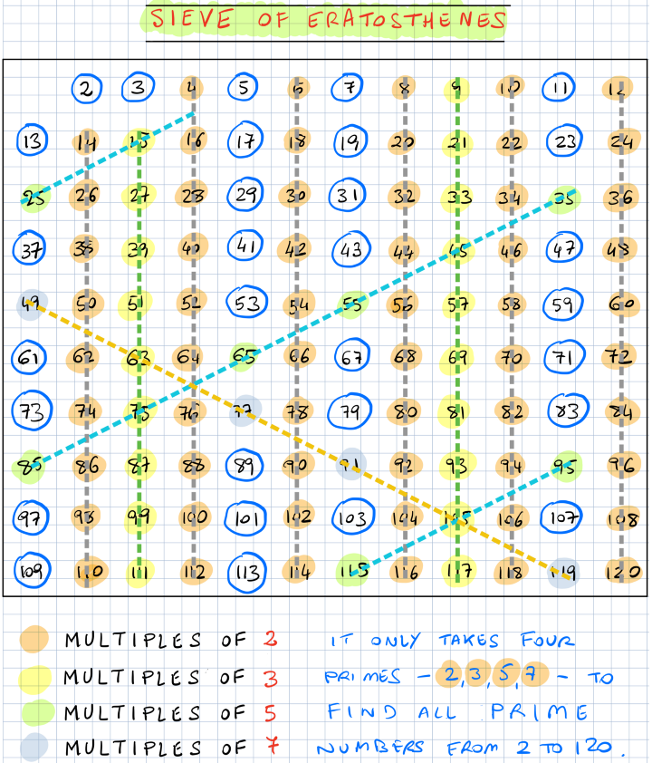
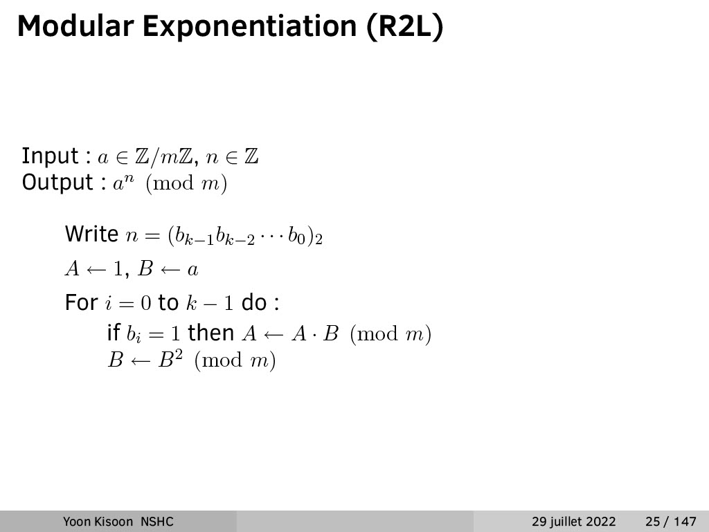
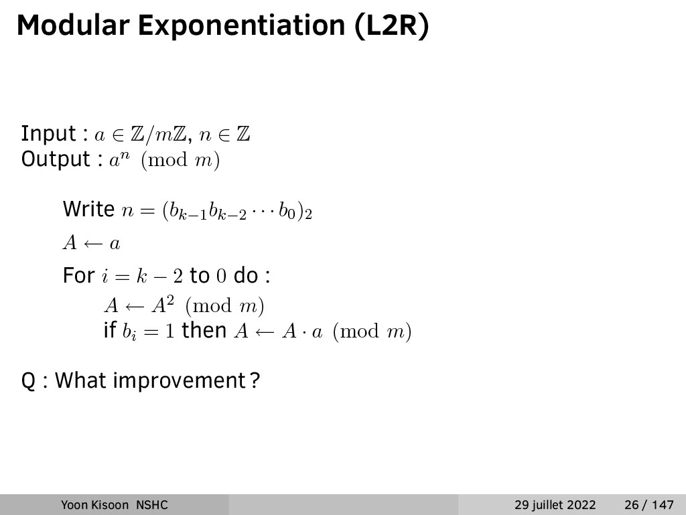

# 1. 에라토스테네스의 체 & 모듈러 지수 연산

---   

## 에라토스테네스의 체




---

## C++ Code
제가 즐겨 쓰는 코드입니다.
```c++
#include <bits/stdc++>
using namespace std;

int main(){
    bool prime[121];
    fill(prime + 2, prime + 121, true);
    
    for(int i = 2; i * i < 121; i++){
        if(not prime[i])
            continue;
        
        for(int j = 2; i * j < 121; j++)
            prime[i * j] = false;
    }
}
```

**O(n log(log n)))** 의 시간복잡도를 가진다고 합니다.  
꽤 빠르죠?   

메모리를 많이 먹는다는 단점이 있습니다.

---

## 모듈러 지수 연산





---

## L2R 방식의 모듈러 지수 연산 구현하기

```c++
#include <bits/stdc++.h>
using namespace std;

unsigned long long ModExp(unsigned, unsigned, unsigned long long);

int main(){
    unsigned a, e;
    unsigned long long m;
    cin >> a >> e >> m;
    cout << "a = " << a << ", e = " << e << ", m = " << m << '\n';

    unsigned long long res = ExpMod(a, e, m);
    cout << "a ^ e mod m = " << res;
}

/********************** Do not fix code above **********************/

unsigned long long ModExp(unsigned a, unsigned e, unsigned long long m){
    string s = bitset<32>(e).to_string();
    unsigned long long res = a;

    /********************* Write code here *********************/
    
    return res;
}
```

위 스켈레톤 코드를 수정하여  
L2R 방식의 모듈러 지수 연산을 구현해봅시다.

즉, a ^ e mod m의 결과를 반환하는 ExpMod 함수를 작성해야 합니다.

