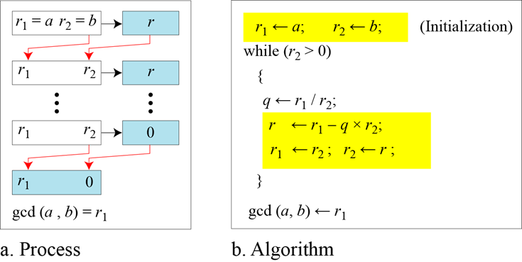
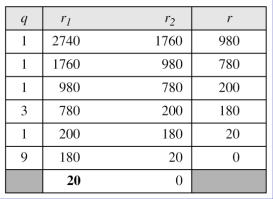
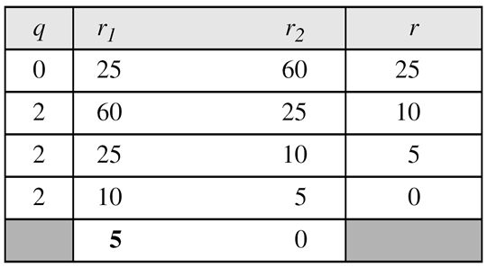
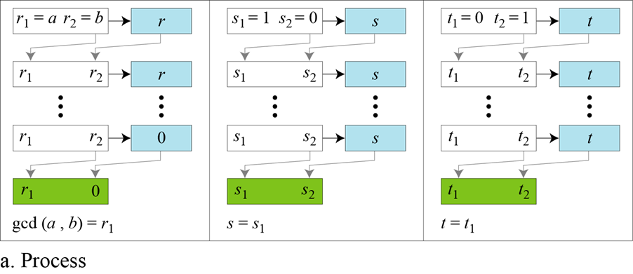
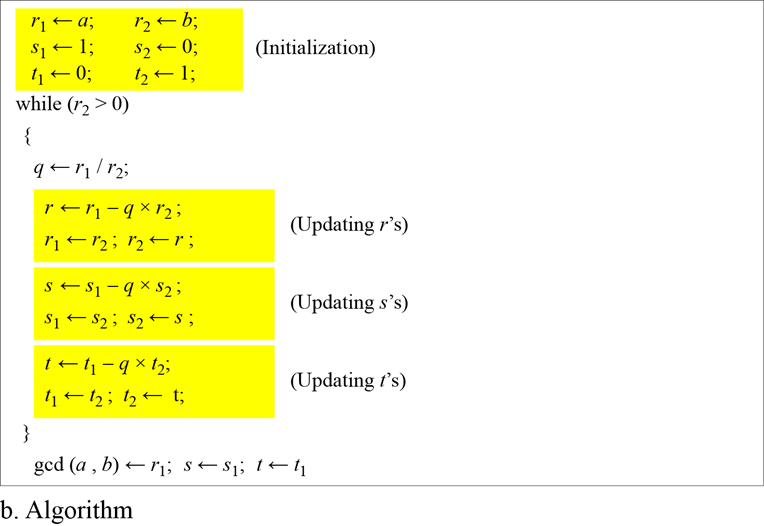
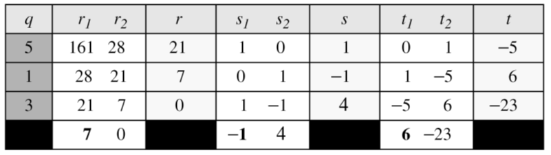
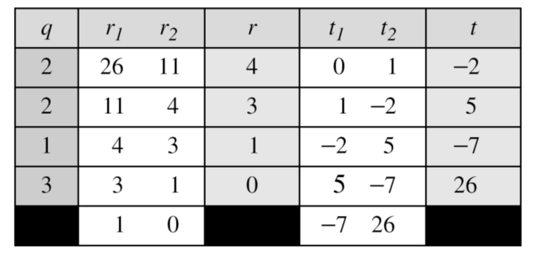
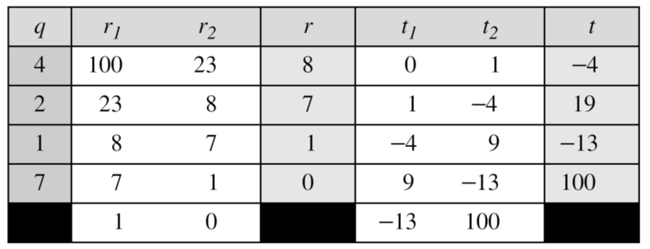
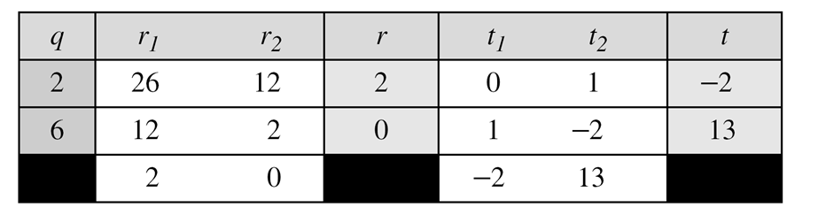

# 2. 유클리드 호제법

---   

https://latte-is-horse.tistory.com/8

## 유클리드 호제법 흐름도 

### 예제 1: gcd(2740, 1760)   

### 예제 2: gcd(25, 60)
    

---
## 확장 유클리드 호제법

### 예제 1 (161 & 28)

### 예제 2 (26 & 11)

### 예제 3 

### 예제 4

